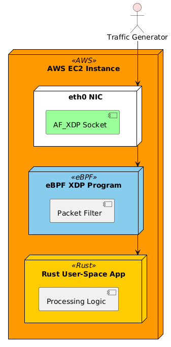

# Rust AF_XDP Demo

Rust AF_XDP demo using Aya for high-performance packet processing. Includes AWS setup via Ansible and containerized deployment options.

[](https://www.rust-lang.org/)
[](https://ebpf.io)
[](https://aws.amazon.com/ec2/)
[](LICENSE)

---

## Overview
`rust-afxdp-demo` provides a **complete solution** for:
- High-performance packet processing using **Rust + eBPF**
- **AF_XDP zero-copy networking**
- **AWS EC2 automation with Ansible**
- **Container-based deployment**

It uses the [Aya](https://github.com/aya-rs/aya) library for writing **safe Rust eBPF programs**, avoiding unsafe C code.

---

## Repository Structure

```shell
rust-afxdp-demo/
├── ansible/
│   ├── inventory/hosts.ini
│   ├── playbooks/
│   │   ├── 01-create-vpc.yml
│   │   ├── 02-launch-ec2.yml
│   │   ├── 03-setup-instance.yml
│   │   └── 04-install-ebpf-tools.yml
├── aya-ebpf/
│   ├── Cargo.toml
│   └── src/
│       ├── main.rs
│       ├── xdp_filter.rs
│       └── common.rs
├── container/
│   ├── Dockerfile
│   └── entrypoint.sh
├── diagrams/
│   ├── architecture.puml        # PlantUML file
│   └── architecture.png         # Rendered diagram (optional)
├── scripts/
│   ├── build.sh
│   ├── run-test.sh
│   └── cleanup.sh
├── docs/
│   ├── AWS_SETUP.md
│   ├── EBPF_AYA_AF_XDP.md
│   ├── CONTAINER_SETUP.md
│   └── TESTING_GUIDE.md
└── .github/
    └── workflows/ci.yml

```


---

## Architecture Diagram  

  
