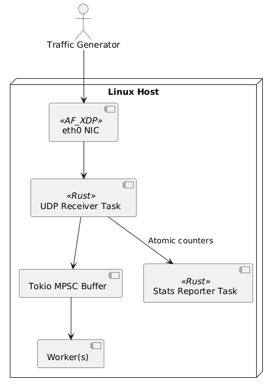

# UDP Benchmark Tool (`udp-bench`)

A high-performance **Rust-based UDP benchmarking tool** for testing network throughput between two endpoints.  
This tool is a lightweight alternative to `iperf3` and is designed to run in **send** or **receive** mode from a single binary.
Optimized for **AF_XDP demonstrations**, this tool simulates real-world traffic patterns while providing **buffered packet processing** and **lock-free stats reporting**.

---

## **Features**
✅ Single binary for both **Send** and **Receive** modes  
✅ Lock-free **atomic counters** for real-time stats  
✅ **Tokio MPSC buffer** between capture and processing to reduce packet drops  
✅ Configurable concurrency, packet size, rate, and buffer size  
✅ Random payload support for realistic traffic  
✅ Designed for AF_XDP-like **zero-copy pipeline integration**
✅ CLI-driven configuration (target IP, rate, packet size, concurrency)  
✅ **Cross-platform** (Windows for sender, Linux for receiver)  
✅ Supports **random payloads** for realistic traffic simulation  
✅ Real-time stats in receive mode  
✅ Highly concurrent, leveraging `tokio` async runtime 

---

## **Build**
Ensure you have **Rust 1.74+** installed:

```shell
cargo build --release --manifest-path udp-bench/Cargo.toml

```
The binary will be at:
```shell
target/release/udp-bench

```

---

## **Usage**

### **Send Mode:**
```shell
udp-bench send \
  --target <receiver-ip> \
  --port 5201 \
  --size 1400 \
  --rate 50000 \
  --duration 30 \
  --concurrency 4 \
  --random-payload

```
### **Receive Mode:**
```bash
udp-bench receive --port 5201 --buffer-size 8192

```

---

### CLI Options
| Option             | Description                          | Default |
| ------------------ | ------------------------------------ | ------- |
| `--target`         | Receiver IP (send mode)              | None    |
| `--port`           | UDP port                             | 5201    |
| `--size`           | Packet size in bytes                 | 1400    |
| `--rate`           | Packets per second                   | 10000   |
| `--duration`       | Duration in seconds                  | 30      |
| `--concurrency`    | Number of parallel sending tasks     | 4       |
| `--random-payload` | Enable random payload                | false   |
| `--buffer-size`    | Channel buffer size for receive mode | 4096    |

---

### **Design Principles**
- **Lock-free Stats Collection:**
  Stats counters (packets, bytes) are updated using atomics to avoid blocking the packet reception loop.  

- **Separate Stats Reporter Task:**
  Reporting runs on a separate task that periodically aggregates and displays stats from atomic counters.

- **Buffering for Burst Handling:**
  Tokio MPSC provides backpressure and buffering to minimize drops during short bursts or under heavy load.

- **AF_XDP Alignment:**
  This architecture mimics AF_XDP’s principles: fast, lock-free, and decoupled processing.

---

### **AF_XDP Architecture**
  

---

### Example Benchmark
**Sender Example**
Send **50,000 PPS for 60 seconds with 4 concurrent tasks** and random payload:
```shell
udp-bench send \
  --target 3.92.123.45 \
  --port 5201 \
  --size 1400 \
  --rate 50000 \
  --duration 60 \
  --concurrency 4 \
  --random-payload

```
**Receiver Example**
Listen on port `5201` and print stats every second:
```shell
udp-bench receive --port 5201 --buffer-size 8192

```
---
### Sample Output
**Sender:**
```shell
Starting UDP send to 3.92.123.45:5201 | size=1400 bytes | rate=50000 pps | duration=60 sec | concurrency=4 | random_payload=true
--- Summary ---
Packets sent: 3,000,000
Total bytes: 4.2 GB
Throughput: 560.00 Mbps

```
**Receiver:**
```shell
Listening for UDP packets on 0.0.0.0:5201 with buffer size 8192
[Stats] Elapsed: 10s | Packets: 500,000 | Bytes: 700 MB | Throughput: 560.00 Mbps

```
---

**Performance Tuning Tips**

* Use **ENA-enabled EC2 instances** (e.g., c5n.large or better) for high PPS.
* Increase `--concurrency` for better NIC utilization.
* Disable firewalls (or allow UDP traffic on chosen port).
* For very high throughput (>1 Gbps), consider increasing kernel buffer sizes:

```shell
sudo sysctl -w net.core.rmem_max=26214400
sudo sysctl -w net.core.wmem_max=26214400

```
Persist in `/etc/sysctl.conf`:
```shell
net.core.rmem_max = 26214400
net.core.wmem_max = 26214400

```
**NIC Offloads**
Disable GRO/LRO for consistent packet delivery:
```shell
sudo ethtool -K eth0 gro off lro off

```
**Windows Sender**
* Ensure firewall allows UDP on chosen port.
* For best results, run in PowerShell admin session.

---

### **When Testing AF_XDP**

If you are testing **AF_XDP performance** on EC2:
* Run `udp-bench` **receiver** alongside your AF_XDP program.
* Use `--random-payload` for realistic load.
* Compare throughput **before and after attaching the XDP program**.

---

### **Expected Throughput**

| Instance Type | Packet Size | PPS Target | Expected Gbps |
| ------------- | ----------- | ---------- | ------------- |
| `c5n.large`   | 1400        | 50k        | \~0.56 Gbps   |
| `c5n.4xlarge` | 1400        | 500k       | \~5.6 Gbps    |

---

### **Troubleshooting**
* **Packets dropping?**
  * Increase `--buffer-size`.
  * Increase receiver socket buffer size.
  * Lower `--rate` or increase `--concurrency`.
* **Sender can't reach target?**
  * Check AWS **security group** and **firewall**.
